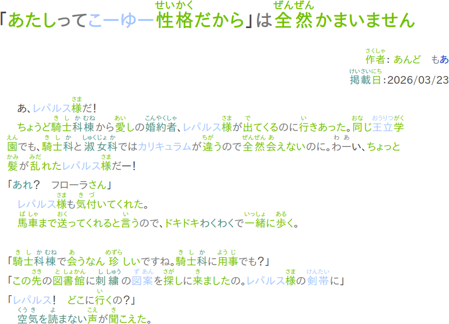
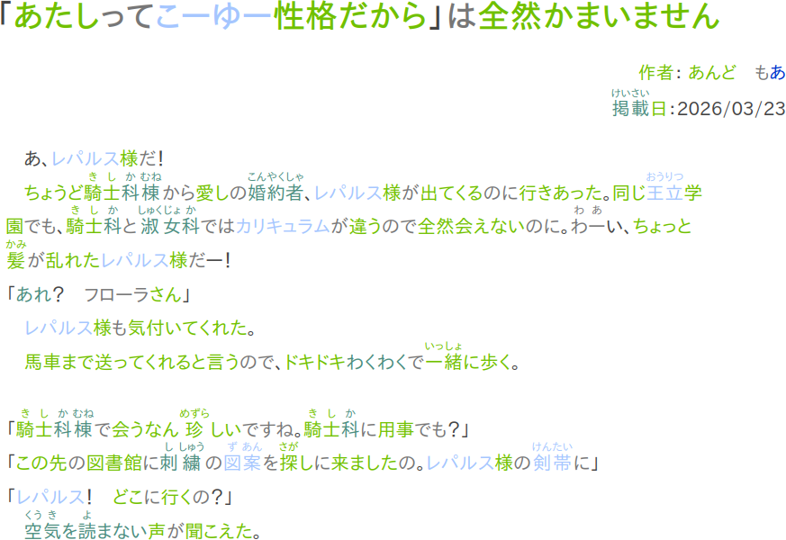
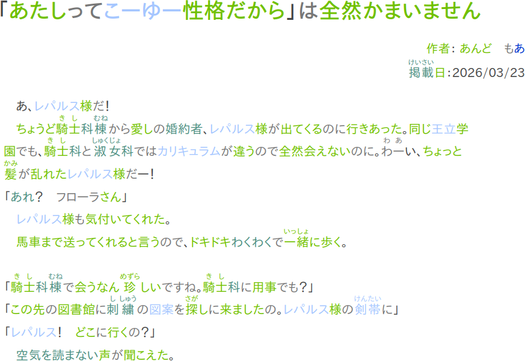

# Feature: tagging known readings
This repository serves as a working example to demonstrate a new feature which would mark parsed words containing known readings with an additional CSS class.  In order to use it, the new setting "Known kanji readings" should be set with a JSON object whose keys are individual kanji or words and whose values are an array of strings containing the corresponding readings.  For example,
```json
{"山": ["さん", "やま"], "一": ["いち", "ひと", "いつ"], "人": ["り", "にん", "ひと", "じん", "とな"], "今日": ["きょう"]}
```
Then, during parsing, any words containing only known kanji readings (i.e. the word doesn't contain unknown kanji or known kanji with unknown readings) are marked with a special CSS class `readable`.  

## Example
The known kanji readings setting was set with the data found in the `sampleReadingMap.json` file, which was generated from the first 30 levels of WaniKani.  Then, a random page (found here)[https://ncode.syosetu.com/n4419ly/] was parsed, and three screenshots were taken, for varying CSS stylings.  

### Default


### Known readings hidden for only known words


Using the CSS rule
```css
.readable:is(.known, .never-forget):not(.misparsed) .jpdb-furi {
    display: none !important;
}
```

### Known readings hidden for all words


Using the CSS rule
```css
.readable:not(.misparsed) .jpdb-furi {
    display: none !important;
}
```
